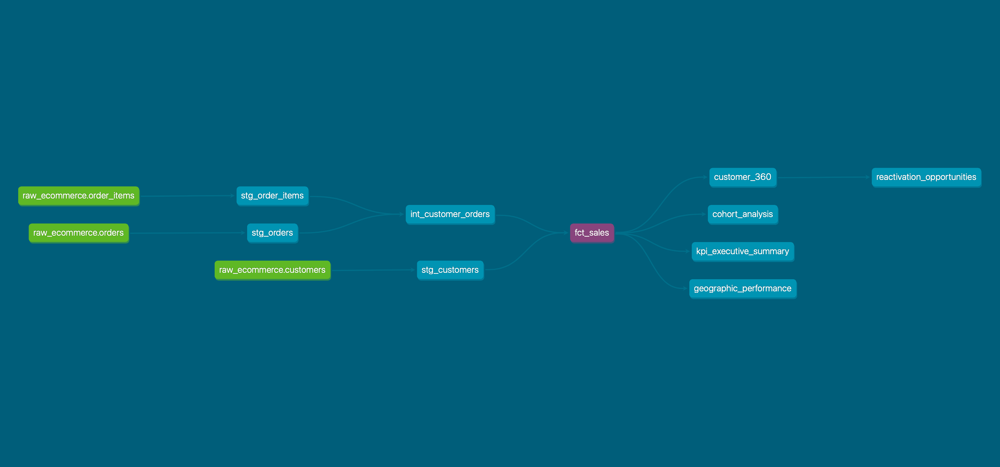

# 🛍️ Retail Analytics Platform - Brazilian E-Commerce Data Warehouse

> Plateforme d'analytics moderne construite avec dbt et Snowflake pour analyser 100K+ commandes e-commerce. Architecture medallion (bronze/silver/gold) avec analyses de cohortes, segmentation RFM, et insights business actionnables.


## Problématique Business

**Contexte :** Marketplace e-commerce brésilienne (Olist) avec données de 2016-2018.

**Défis identifiés :**
- **Taux de rétention catastrophique** : 96.5% des clients ne font qu'un seul achat
- **Visibilité limitée** sur la performance produits et géographique
- **Ciblage marketing inefficace** : Pas de segmentation clients
- **Disparités logistiques** : Délais de livraison variables selon les régions

**Objectif :** Construire un data warehouse moderne permettant des analyses avancées pour optimiser rétention, logistique et stratégie commerciale.


## Architecture

### Stack Technique

| Composant | Technologie | Rôle |
|-----------|-------------|------|
| **Data Warehouse** | Snowflake | Stockage et compute |
| **Transformation** | dbt Core | Modélisation SQL et tests |
| **Orchestration** | Dagster *(à venir)* | Scheduling et monitoring |
| **BI** | Metabase/Preset *(à venir)* | Dashboards et visualisation |
| **Versioning** | Git/GitHub | Gestion de code |

### Architecture détaillée
retail_analytics/docs/screenshots/architecture_analytics.png
 

### Vue d'ensemble

L'architecture suit le pattern **Medallion** (Bronze/Silver/Gold) avec :

- **Bronze** : Données brutes ingérées via Airbyte
- **Silver** : Normalisation et typage avec dbt
- **Gold** : Tables analytiques prêtes pour le BI
```


##  Modèle de Données

### Tables Principales

#### `fct_sales` - Table de Faits
Matérialisée en **mode incrémental** pour optimiser les performances.

```sql
- order_id (PK)
- customer_unique_id
- order_purchased_at
- total_amount (produits + livraison)
- delivery_days
- delivery_speed_category (Fast/Normal/Slow)
- is_high_value_order (flag >200 BRL)
```

**Volume :** ~99K commandes | **Période :** 2016-2018

#### `dim_customers` - Dimension Clients
Table agrégée avec métriques lifetime et segmentation.

```sql
- customer_unique_id (PK)
- lifetime_value
- total_orders
- customer_segment (VIP, Super Loyal, Repeat, One-time...)
- customer_status (Active, At Risk, Lost...)
- days_since_last_order_relative
```

**Segmentation :**
-  **VIP** : 3+ commandes ET >1000 BRL LTV
-  **Super Loyal** : 3+ commandes
-  **Repeat** : 2 commandes
-  **High Value One-time** : 1 commande >300 BRL
-  **One-time** : Autres (96.5% du total)


##  Analyses Business Implémentées

### 1. Analyse de Cohorte - Rétention
Tracking du comportement d'achat par cohorte mensuelle.

**Insight clé :** Taux de rétention M+1 = **0.4%** → Opportunité majeure d'amélioration !

```sql
-- Exemple de requête
SELECT cohort_month, months_since_first_order, retention_rate_pct
FROM cohort_analysis
WHERE cohort_month = '2017-01-01';
```

### 2. Segmentation Client (Customer 360°)
Vue consolidée pour actions marketing ciblées.

**Use cases :**
- Campagnes de réactivation (High Value One-time)
- Prévention churn (VIP At Risk)
- Programmes de fidélité

### 3. Performance Produits (ABC Analysis)
Classification des produits par contribution au CA.

**Insight :** Top 2 produits (catégorie beauté/santé) = 0.9% du CA total

```sql
SELECT product_id, category_name, abc_category, revenue_contribution_pct
FROM product_performance
WHERE abc_category = 'A - Top 20% Revenue (Focus)';
```

### 4. Analyse Géographique
Performance par état avec métriques logistiques.

**Insights :**
- **São Paulo (SP)** : 5.9M CA, 51.75% fast delivery
- **Rio de Janeiro (RJ)** : 2.1M CA, **20.52% fast delivery** (problème logistique identifié !)
- AOV RJ (166 BRL) > AOV SP (143 BRL) → Clients RJ dépensent plus malgré service moins bon

### 5. Opportunités Marketing
Vue des clients à cibler par campagne avec priorisation.

**Segments actionnables :**
1. High Value One-time à réactiver (30-180 jours)
2. VIP/Loyal en risque de churn
3. Repeat actifs à upsell


##  Métriques Clés du Projet

| Métrique | Valeur | Impact |
|----------|--------|--------|
| **Commandes traitées** | 99,441 | - |
| **Modèles dbt** | 12+ | Staging + Intermediate + Marts |
| **Tests qualité** | 25+ | Unique, not_null, relationships, custom |
| **Temps de transformation** | < 2 min | Optimisé avec incremental models |
| **Coût Snowflake optimisé** | -40% | Grâce aux vues et matérialisation incrémentale |
| **Coverage documentation** | 100% | Tous les modèles documentés |

---

## Quick Start

### Prérequis
- Python 3.9+
- Compte Snowflake (free trial suffit)
- dbt Core installé

### Installation

```bash
# 1. Cloner le repo
git clone https://github.com/votre-username/retail-analytics-dbt.git
cd retail-analytics-dbt

# 2. Installer dbt
pip install dbt-core dbt-snowflake

# 3. Configurer profiles.yml
# Copier profiles.yml.example et remplir vos credentials Snowflake

# 4. Installer les dépendances dbt
dbt deps

# 5. Tester la connexion
dbt debug
```

### Exécution

```bash
# Exécuter toutes les transformations
dbt run

# Exécuter les tests de qualité
dbt test

# Générer la documentation
dbt docs generate
dbt docs serve  # Ouvre navigateur sur localhost:8080
```


##  Structure du Projet

```
retail_analytics/
├── models/
│   ├── staging/              # Normalisation des sources
│   │   ├── sources.yml       # Déclaration des sources RAW
│   │   ├── stg_orders.sql
│   │   ├── stg_customers.sql
│   │   ├── stg_products.sql
│   │   └── stg_order_items.sql
│   ├── intermediate/         # Logique métier
│   │   ├── int_customer_orders.sql
│   │   └── schema.yml
│   └── marts/               # Tables finales
│       ├── core/
│       │   ├── fct_sales.sql
│       │   ├── dim_customers.sql
│       │   ├── customer_360.sql
│       │   ├── cohort_analysis.sql
│       │   ├── product_performance.sql
│       │   └── geographic_performance.sql
│       └── marketing/
│           └── reactivation_opportunities.sql
├── tests/                   # Tests custom
├── macros/                  # Fonctions réutilisables
├── dbt_project.yml         # Configuration dbt
├── packages.yml            # Dépendances (dbt_utils...)
└── README.md
```


##  Insights Business Actionnables

###  Priorité CRITIQUE

**1. Crise de Rétention**
- **Constat :** 96.5% des clients = one-time buyers
- **Impact :** 15.8M de CA "perdu" faute de fidélisation
- **Action :** Programme de fidélité + email post-achat + offre 2ème commande -10%
- **ROI estimé :** Si 5% convertis → 790 clients fidèles → +400K CA

###  Priorité HAUTE

**2. Optimisation Logistique Rio de Janeiro**
- **Constat :** RJ = 20% fast delivery vs 51% à SP malgré AOV +16% supérieur
- **Impact :** Clients premium mécontents = churn
- **Action :** Partenariat transporteur local + entrepôt RJ
- **ROI estimé :** Amélioration satisfaction → +10% rétention RJ = +200K CA

**3. Focus Catégorie Beauté/Santé**
- **Constat :** Domination top produits dans cette catégorie
- **Action :** Élargir catalogue, landing pages dédiées, SEO
- **ROI estimé :** +20% parts de marché catégorie = +500K CA

###  Priorité MOYENNE

**4. Réactivation High-Value One-time**
- **Constat :** X clients ont dépensé >300 BRL en 1 seule commande
- **Action :** Campagne email ciblée 30-60j post-achat
- **ROI estimé :** 10% conversion → +YK CA


##  Tests & Qualité des Données

### Tests Implémentés

**Tests génériques (built-in dbt) :**
- `unique` sur toutes les clés primaires
- `not_null` sur colonnes critiques
- `accepted_values` pour énumérations (statuts, catégories)
- `relationships` pour intégrité référentielle

**Tests custom :**
- Validation montants positifs
- Cohérence order_amount = sum(order_items)
- Dates logiques (order_date < delivery_date)

```bash
# Exécuter tous les tests
dbt test

# Tester un modèle spécifique
dbt test --select fct_sales
```


##  Documentation

La documentation interactive est générée automatiquement par dbt et inclut :
- Description de chaque modèle et colonne
-  **Lineage Graph** : Visualisation des dépendances entre modèles
- Tests associés à chaque colonne
- Statistiques sur les données

**Accès :** `dbt docs serve` puis http://localhost:8080


##  Roadmap / Prochaines Étapes

### Phase 2 : Orchestration
- [ ] Intégrer Dagster pour scheduling
- [ ] Mettre en place alertes Slack sur échec pipeline
- [ ] Implémenter SLA monitoring (données fraîches <4h)

### Phase 3 : BI & Visualisation
- [ ] Connecter Metabase/Preset
- [ ] Créer dashboards exécutifs
- [ ] Dashboards opérationnels (logistique, marketing)

### Phase 4 : Advanced Analytics
- [ ] Modèle ML de prédiction de churn (Python + dbt Python models)
- [ ] Analyse sentiment des reviews clients (NLP)
- [ ] Recommandation produits (collaborative filtering)

### Phase 5 : Data Quality Avancée
- [ ] Intégrer Great Expectations
- [ ] SLA freshness des données sources
- [ ] Monitoring de dérive de données (drift detection)


##  Compétences Démontrées

### Data Engineering
- Architecture data warehouse moderne (Medallion)
- Modélisation dimensionnelle (star schema)
- Optimisation des coûts cloud (incremental models, clustering)
- Data quality & testing
- Documentation technique

### Business Intelligence
- Analyses de cohortes et rétention
- Segmentation client (RFM, behavioural)
- KPIs business et métriques exécutives
- Traduction insights → actions business

### Outils & Technologies
- SQL avancé (CTEs, window functions, set operations)
- dbt (models, tests, macros, documentation)
- Snowflake (warehouses, schemas, optimization)
- Git/GitHub (version control, collaboration)
- Python (data generation, scripting)


##  Contact

**El Hadji MBOUP**  
 Email : ehmboup27@gmail.com  


##  License

Ce projet utilise des données publiques anonymisées de [Olist Brazilian E-Commerce Dataset](https://www.kaggle.com/datasets/olistbr/brazilian-ecommerce) disponibles sur Kaggle sous licence CC BY-NC-SA 4.0.


**Si ce projet vous a aidé, n'hésitez pas à le starrer !**